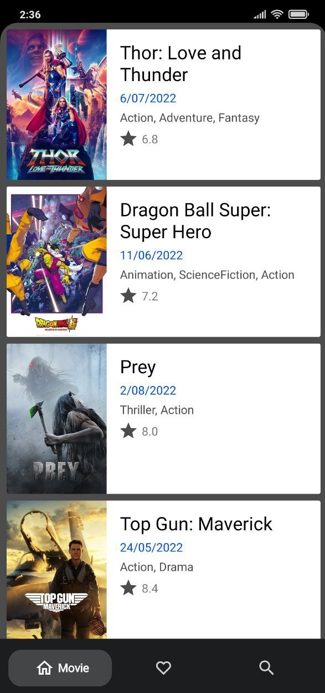
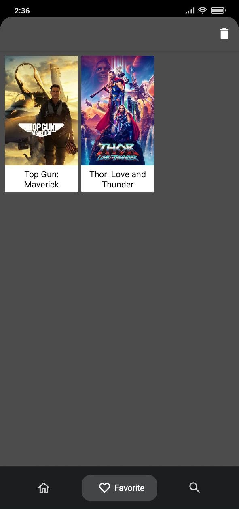
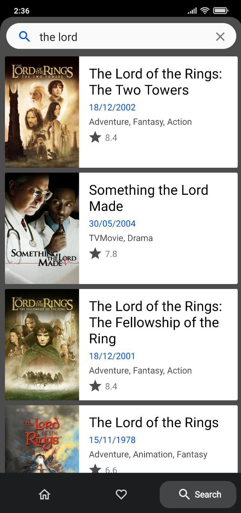

# MovieApp
MovieApp is a simple Android project on MVVM architecture.

## Tech Stacks
* 100% Kotlin
* MVVM architecture
* Kotlin Coroutines + Flow
* Single activity pattern
* Koin
* Room
* Retrofit
